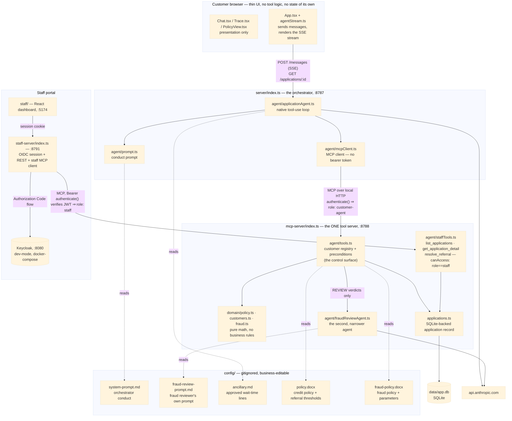
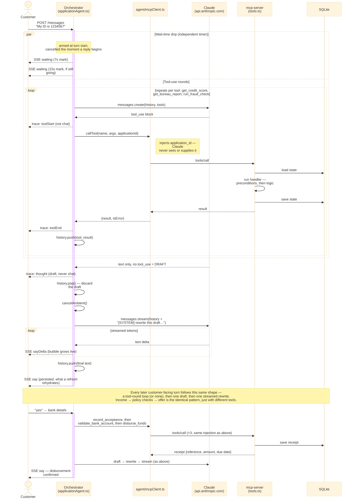

# Architecture

How a customer message actually moves through this system, end to end. The README covers "run it" and "tinker with it"; this is the deeper reference — what talks to what, why the boundaries are drawn where they are, and what each of the two agents in this app is and isn't trusted with.

*Last updated: 2026-09-27, adding the staff portal (Step 4: human referral + Keycloak auth).*

## System diagram

*Exported copy: [`architecture.svg`](architecture.svg) — regenerate with `npm run diagram` after editing the block above.*

Two processes, not one. The tool server is its own service specifically so a future second client (a back-office review tool) can connect to the exact same underwriting logic without importing this app's code — but it isn't exposed publicly. The orchestrator reaches it over plain local HTTP as an ordinary MCP client, the same shape as the Vite↔orchestrator split already uses. Anthropic's own `mcp_servers` API parameter was considered and rejected for this specific reason: it requires the MCP server to be reachable over public HTTPS, since that's Anthropic's own infrastructure connecting to it directly — not a fit for a lending backend's tool layer.

## The two agents

**The application agent** (`server/agent/applicationAgent.ts`) is the one thing a customer ever talks to. It sees the whole conversation, decides which tool to call next, and is the only thing that ever produces customer-facing text. It is deliberately *not* trusted with numbers: every score, rate, DSR figure, and decision it relays came back from a tool call in this session — it never computes one itself.

**The fraud reviewer** (`server/agent/fraudReviewAgent.ts`) is a second, much narrower agent. It only runs when the deterministic fraud rules in `agent/tools.ts` can't resolve a case cleanly on their own (a `REVIEW` verdict, not a `PASS` or `FLAG`), and it's shown *only* the specific signals in question — no name, no loan amount, no conversation history. It cannot approve or decline anything; it can only answer `CLEAR` or `FLAG` on the narrow question in front of it. That narrowness is the actual control: unlike the orchestrator, it has no other context available to be reasoned around.

Both agents' system prompts live outside source control — `config/system-prompt.md` and `config/fraud-review-prompt.md` — for the same reason: they specify real behavioral and detection logic a public repository shouldn't carry, business-editable without a code change.

## One customer message, step by step

How the model actually talks to the rest of the stack, end to end — not every tool call (the identity chain's shape repeats three more times across a full application), but every *kind* of exchange that happens:

*Exported copy: [`sequence.svg`](sequence.svg) — regenerate with `npm run diagram` after editing the block above.*

1. The browser POSTs the message to `/api/applications/:id/messages`; the orchestrator opens an SSE stream and starts the loop.
2. The orchestrator calls the Anthropic Messages API with the conversation history and the tool schemas it got from the MCP tool server (fetched once at startup, cached — tool descriptions don't change at runtime).
3. If the model's response contains `tool_use` blocks, the orchestrator:
   - lets the **wait-time drip** run (armed at the top of the turn, not here): if the turn passes 7s, a pre-approved line from `config/ancillary.md` is streamed as a `waiting` event and rendered beside the typing indicator, with a second at 15s. These are *not* chat messages — they never enter `msgs`, are never persisted, and are cleared the instant a real reply arrives, so nothing can end up sitting in the transcript above a decision. Never model-authored, so there's nothing to leak; keyed on elapsed time rather than journey state, so the drip can't signal that a case went to review; and stood down as soon as the agent starts composing its reply, so a line never lands just ahead of the answer;
   - runs each tool call **serially** through the MCP client, which injects `application_id` into the call — the model never sees or supplies this, the same way it never saw the raw application state directly;
   - records any text the model wrote alongside the tool call to the trace as a `REASON` entry, never to the chat;
   - feeds the results back as `tool_result` blocks in one message, and calls the model again.
4. Once a response comes back with no `tool_use` blocks, that's a *draft* of the turn-ending reply — not the final one. In testing, that first draft reliably bled reasoning into the reply anyway ("The fraud check has passed. Could you tell me your income?"), even with an explicit prompt rule and example, because free text has no structural wall between "internal note" and "customer reply" the way a JSON contract's separate fields would. So there's a second, narrowly-scoped call whose only job is producing the clean version. Crucially it is handed the draft and asked to **rewrite** it — keep the same question, information and decision, change only the wording. Asking it to compose afresh instead leaves it re-deriving the reply from tool results alone, which silently loses any decision the draft reached that tool state doesn't record. Same "escalate only the case that needs it" shape the fraud reviewer already uses, applied here to every reply instead of a rare case.

   This second call is **streamed** — the only streamed call in the system. Its output is customer-facing by construction, so there is nothing to inspect before it reaches the screen; the draft call must never be streamed, since its whole purpose is to be discarded. Chunks go out as `sayDelta` events for progressive rendering and are never persisted; `say` follows with the complete text, and that is what the transcript stores and a refresh rehydrates. Measured gain: ~0.7s at p50, ~1.8s on the offer message — see [`performance.md`](performance.md).
5. Each tool call, inside the MCP server, loads that one application's state from SQLite, runs its precondition checks and logic, saves state back, and returns — self-contained, not relying on any in-memory session shared with the orchestrator.

`MAX_STEPS = 10` bounds the whole thing — an agent that can't settle in ten rounds is stuck, and a stuck agent that keeps calling is an unbounded bill.

## Where the controls actually live

**Sequence is enforced in the tools, not the prompt.** `assess_affordability` returns `NO_POLICY` if `read_policy_document` hasn't run yet; `disburse_funds` requires both an accepted offer and a validated bank account. The conduct prompt *describes* the intended order; the tool preconditions are what actually refuse to let it be skipped. A rule a model can be talked out of isn't a control — a precondition in a handler is.

**Values are business-editable; decision logic isn't.** `config/policy.docx` and `config/fraud-policy.docx` each carry a prose section for humans and a Machine-Readable Parameters section the tool layer actually reads (`server/policyDocument.ts` / `server/fraudPolicyDocument.ts`, both validate strictly — a missing or malformed parameter fails the server at startup rather than silently running with a wrong number). What's *not* in either document is the logic that turns those numbers into a verdict — which combination of signals is an automatic `FLAG` versus a `REVIEW`, how three independent caps resolve into one `max_principal`. That stays in `server/agent/tools.ts`, inlined the same way `run_policy_checks` and the fraud/income checks all keep their real comparisons in code. `server/domain/policy.ts` and `server/domain/fraud.ts` are deliberately just calculation helpers — `instalmentFor`, `totalFacilityLimit`, `incomeToLimitRatio` — with no notion of what a "good" score or a "suspicious" ratio is. Reading either file top to bottom tells you nothing about the actual policy; that's by design; parsing decision logic out of business-editable prose would be far riskier than parameterizing a threshold.

**Rejections are never explained, structurally.** Whether it's a fraud `FLAG`, an income-mismatch `FLAG`, or a policy `DECLINE`, the conduct prompt treats all three as the same case: tell the customer plainly that the application wasn't successful, point them at customer care, stop — never name the score, the rule, or the signal. An applicant who learns exactly what tripped a rejection can tune the next application around it specifically.

## Persistence

One SQLite table (`applications`), one row per application: `state` (what the tools mutate), `history` (what the model sees), `msgs`/`trace` (what the UI renders). Two different processes write to it, deliberately through two different functions — `saveApplicationState` (MCP server, once per tool call) and `saveApplicationChat` (orchestrator, once per turn) — never one function that touches both, since the two processes no longer share memory and a combined save would let one clobber the other's more recent write.

A refresh reconnects to the same application (`sessionStorage` keeps the id, `GET /api/applications/:id` rehydrates) instead of losing it — the actual point of moving off a browser-only `useRef`.

## The staff portal — one tool server, two audiences

The MCP server has always been described as built for a second client without importing this app's code. This is that second client, and it changes the tool server from "the customer agent's private backend" into a real multi-tenant boundary — the interesting part is that this needed no second process.

**`authenticate()` classifies every connection; `canAccess` is what actually gates a tool.** `mcp-server/index.ts` now has an `authenticate(request)` hook that runs once per connection. No `Authorization` header at all — the customer orchestrator's connection, byte-for-byte unchanged — resolves to `{ role: "customer-agent" }`. A `Bearer` token gets verified against Keycloak's JWKS (`jose`'s `createRemoteJWKSet`/`jwtVerify`, fetched lazily on first use, not at boot — the customer path needs no Keycloak running at all); a token that verifies and carries the realm's `staff` role resolves to `{ role: "staff", sub, username }`. Anything in between — a header present but malformed, expired, wrong issuer, missing the role — returns `null`, which fastmcp turns into a hard 401. It never falls back to `customer-agent` on a bad token: that would let a broken or forged staff credential quietly downgrade into customer-only access instead of being rejected outright.

Each of the three staff tools (`agent/staffTools.ts`: `list_applications`, `get_application_detail`, `resolve_referral`) is registered with `canAccess: (auth) => auth.role === "staff"`. fastmcp filters the tool set per session *before* both `tools/list` and `tools/call` — a customer-agent connection never sees these names exist, and calling one directly by name fails `Unknown tool`, not a permissions error, because it was never in that session's tool map to begin with.

**Reviewer identity comes from the verified token, never a request argument** — `resolve_referral` reads `ctx.auth.sub`/`ctx.auth.username`, ignoring any `reviewerId`/`reviewerName` a caller might put in the arguments. Same principle this app already applies to `application_id` (the model never sees or supplies it); extended one hop further, to the human on the other end of the staff connection.

## The referral state machine — a blocking hold, not a post-hoc log

Two triggers, both evaluated inside the tool that already computed the real outcome, both in `server/agent/tools.ts`:

- **`run_policy_checks`** holds a `DECLINE` when the only failed rule is `§2.1 Bureau score floor`, within a new `referralScoreMargin` points of `policy.minScore` — a risk-appetite judgment call, not the bright-line kind (a real default, too many enquiries). `§3.2 DSR headroom exists` is allowed to fail alongside it without disqualifying the case: the lowest pricing tier's floor equals `policy.minScore`, so any score that fails §2.1 gets no rate from `priceFor`, which mechanically zeroes the DSR-based cap and fails §3.2 too — every time, not just near the threshold. That's a consequence of not being priced, not independent evidence of over-gearing.
- **`generate_offer`** holds a fully-priced offer once computed, if its principal exceeds a new `policy.referralPrincipalThreshold` — both new numbers live in `config/policy.docx`'s Machine-Readable Parameters section, the same values-vs-logic split every other threshold in this app already follows.

Both tools return `{ status: "PENDING_REVIEW" }` instead of the real result, and store the **exact already-computed result** (the `DECLINE` payload, or the priced offer) on `ApplicationState.referral.pendingResult`. On resolution, `UPHOLD` replays that stored result verbatim rather than recomputing — recomputing would depend on the model re-supplying identical arguments (`generate_offer`'s `amount`/`tenor_months`) on the customer's return, which nothing guarantees, and on policy config being unchanged since the hold. `OVERTURN` returns the flipped outcome instead — a near-threshold decline becomes `PROCEED`; a high-principal offer becomes a plain `DECLINE`, shaped exactly like any other rejection, so the existing non-disclosure conduct rule covers it with no new prompt logic.

There is no outbound contact channel — chat only — so resumption relies on the customer's own next message re-entering the same tool call, per the conduct prompt's existing chaining rules. In testing this needed no special-casing: nudged mid-hold, the agent independently re-called the blocked tool on its own reasoning to check whether a decision was ready.

## What this deliberately isn't

See the README's "What is not production" section for the full list. Auth now covers the MCP server's staff boundary and the staff portal's own session, and there's a real human-in-the-loop referral path — both closed by this step. Still open: no auth on the customer orchestrator's own `/api` routes, free-text bank details, SQLite as a single-instance store, and — new with this step — Keycloak running in dev mode with no TLS, an in-memory session store, and a hand-authored realm import checked in with a placeholder client secret (all clearly dev-only, none of it fit to face the internet). Kept that way so the moving parts stay visible in a demo, not because any of them would be hard to fix.
